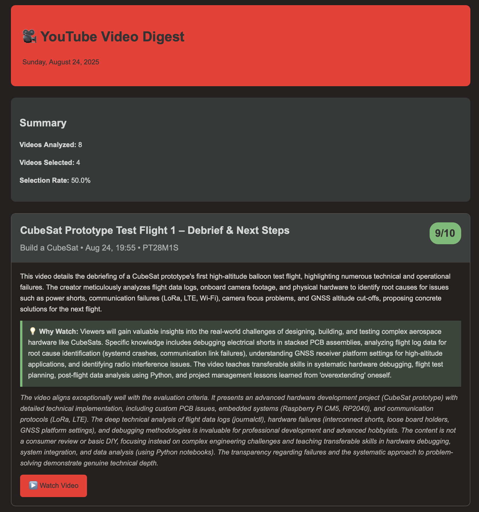

# Agent Stack

A collection of intelligent automation agents. The first agent is YouTube Curator, which uses AI to curate and deliver personalized video recommendations via email.

## Agents

### 🎥 YouTube Curator
Analyzes your YouTube subscriptions using AI to find the most relevant videos worth watching.

**Features:**
- 🤖 **AI-Powered Analysis**: Uses Google Gemini 2.5 to analyze video content, titles, and transcripts
- 📺 **YouTube Integration**: Automatically fetches new videos from your subscriptions
- 📧 **Smart Email Digests**: Sends beautifully formatted HTML emails with relevant videos
- ⚙️ **Customizable Criteria**: Define your own guidelines for video selection
- ⏰ **Scheduled Execution**: Runs daily via cron to keep you updated
- 🗃️ **Smart Deduplication**: Avoids re-analyzing videos from the last 7 days
- ⚡ **Content Filtering**: Automatically filters out YouTube Shorts (≤60 seconds) to focus on substantive content
- 🎬 **Long Video Handling**: Special metadata-only analysis for extra-long videos (>1 hour) to avoid token limits

**Example Email Output:**



## Features

- 🐳 **Docker Ready**: Optimized for deployment on Raspberry Pi and other platforms
- 🔒 **Secure**: API keys managed via environment variables  
- 📊 **Built-in Monitoring**: Health checks and status tracking
- ⏰ **Scheduled Execution**: Runs daily via cron scheduler

## Quick Start

### Prerequisites

1. **YouTube OAuth 2.0 Credentials**
   - Go to [Google Cloud Console](https://console.cloud.google.com/)
   - Enable YouTube Data API v3
   - Create OAuth 2.0 credentials (Desktop Application)
   - Configure OAuth consent screen with YouTube readonly scope

2. **Google AI Studio API Key**
   - Visit [Google AI Studio](https://makersuite.google.com/app/apikey)
   - Create a new API key for Gemini access

3. **Email Configuration**
   - For iCloud: Enable 2FA and create an app-specific password
   - For other providers: Ensure SMTP access is enabled

### Installation

#### Option 1: Docker (Recommended)

```bash
# Clone the repository
git clone https://github.com/ETeissonniere/agent-stack.git
cd agent-stack

# Create environment file
cp .env.example .env
# Edit .env with your OAuth credentials and email settings

# Configure your preferences, edit config.yaml with your criteria and settings

# Build the container
docker build -t agent-stack .

# First-time setup (interactive OAuth authorization)
# The data volume persists OAuth tokens and video analysis state
docker run --rm -it --env-file .env \
  -v $(pwd)/config.yaml:/app/config.yaml:ro \
  -v $(pwd)/data:/app/data \
  agent-stack ./youtube-curator --once

# After OAuth setup, run with Docker Compose
docker-compose up -d
```

#### Option 2: Local Build

```bash
# Clone and build
git clone https://github.com/ETeissonniere/agent-stack.git
cd agent-stack
go build -o youtube-curator ./agents/youtube-curator/cmd

# Set environment variables
export GOOGLE_CLIENT_ID="your-client-id.apps.googleusercontent.com"
export GOOGLE_CLIENT_SECRET="your-client-secret"
export GEMINI_API_KEY="your-gemini-api-key"
export EMAIL_USERNAME="your-email@icloud.com"
export EMAIL_PASSWORD="your-app-specific-password"

# Run once to test
./youtube-curator --once
```

## Configuration

### Environment Variables

Create a `.env` file:

```bash
GOOGLE_CLIENT_ID=your_client_id_here.apps.googleusercontent.com
GOOGLE_CLIENT_SECRET=your_client_secret_here
GEMINI_API_KEY=your_gemini_api_key_here
EMAIL_USERNAME=your-email@icloud.com
EMAIL_PASSWORD=your_app_specific_password
```

### Configuration File

Edit `config.yaml`:

```yaml
youtube:
  client_id: "" # Set via GOOGLE_CLIENT_ID env var
  client_secret: "" # Set via GOOGLE_CLIENT_SECRET env var
  token_file: "data/youtube_token.json"

ai:
  gemini_api_key: "" # Set via GEMINI_API_KEY env var
  model: "gemini-2.5-flash"

email:
  smtp_server: "smtp.mail.me.com"  # iCloud SMTP
  smtp_port: 587
  username: "" # Set via EMAIL_USERNAME env var
  password: "" # Set via EMAIL_PASSWORD env var
  from_email: "your-email@icloud.com"
  to_email: "your-email@icloud.com"

guidelines:
  criteria:
    - "Educational content about programming, technology, or software development"
    - "High-quality tutorials or explanations of complex topics"
    - "Industry insights from experienced professionals"
    - "New technology announcements or reviews"
    - "Content that would help with professional development"
    - "Avoid clickbait or overly promotional content"
    - "Prefer content from established creators with good reputation"

schedule: "0 9 * * *" # Daily at 9 AM
```

## Usage

### Commands

```bash
# Run once for testing
./youtube-curator --once

# Run with scheduler (default)
./youtube-curator
```

### Docker Commands

```bash
# View logs
docker logs youtube-curator

# Run once in container
docker-compose run youtube-curator ./youtube-curator --once

# Rebuild after changes
docker-compose up --build
```

## Email Setup

### iCloud Mail Configuration

1. Enable two-factor authentication for your Apple ID
2. Generate an app-specific password:
   - Go to appleid.apple.com
   - Sign in and go to Security section
   - Generate password for "Agent YouTube"
3. Use your full iCloud email as username
4. Use the generated password as the password

### Other Email Providers

- **Gmail**: Use app passwords with 2FA enabled
- **Outlook**: Use app passwords or OAuth2
- **Custom SMTP**: Update server and port in config

## Customization

### Video Selection Criteria

Modify the `guidelines.criteria` in `config.yaml` to match your interests:

```yaml
guidelines:
  criteria:
    - "Machine learning and AI tutorials"
    - "Software architecture discussions"
    - "DevOps and infrastructure content"
    - "Startup and business insights"
    - "Avoid content shorter than 10 minutes"
    - "Prefer channels with over 10k subscribers"
```

### Scheduling

The cron schedule format supports:
- `"0 9 * * *"` - Daily at 9 AM
- `"0 9 * * 1"` - Weekly on Monday at 9 AM  
- `"0 */6 * * *"` - Every 6 hours

### AI Model Selection

You can change the Gemini model in config:
- `gemini-2.5-flash` (recommended, fastest with latest features)
- `gemini-2.5-flash-lite` (ultra-fast, lower cost option)
- `gemini-2.5-pro` (most advanced with thinking capabilities)

## Troubleshooting

### Common Issues

**No videos found:**
- Verify YouTube API key is correct
- Check if you have public subscriptions
- Ensure API quotas aren't exceeded

**Email not sending:**
- Verify SMTP credentials
- Check app-specific password for iCloud
- Test with `--once` flag for detailed logs

**AI analysis failing:**
- Verify Gemini API key
- Check API rate limits
- Ensure model name is correct

**Transcript errors:**
- Some videos don't have transcripts available
- Non-English videos may have limited transcript support
- Analysis continues without transcript if unavailable

### Logs

Check application logs for detailed error information:

```bash
# Docker logs
docker logs youtube-curator -f

# Local logs
# Application logs to stdout
```

## Security Notes

- Store API keys in environment variables only
- Use app-specific passwords for email accounts
- Regularly rotate API keys
- Monitor API usage for unexpected charges

## Contributing

1. Fork the repository
2. Create a feature branch
3. Make your changes
4. Add tests if applicable
5. Submit a pull request

## License

This project is open source. See LICENSE file for details.

## Support

For issues and questions:
1. Check the troubleshooting section
2. Review logs for error details
3. Open an issue with reproduction steps

## Project Structure

```
agent-stack/
├── agents/                    # YouTube curator agent
│   └── youtube-curator/       # YouTube curation agent
│       ├── cmd/               # Agent entry point
│       ├── youtube/           # YouTube API client
│       └── youtube_agent.go   # Main agent implementation
├── shared/                    # Shared libraries
│   ├── config/                # Configuration management
│   ├── monitoring/            # Health checks and monitoring
│   ├── email/                 # Email notifications
│   ├── storage/               # Persistent state management
│   └── ai/                    # AI/LLM integrations
├── internal/                  # Shared data models
│   └── models/                # Common data structures
├── data/                      # Persistent data (OAuth tokens, video state)
├── docker-compose.yml         # Container orchestration
└── config.yaml              # Application configuration
```

## Architecture

See `CLAUDE.md` for detailed technical documentation, including:
- Component architecture
- API integration details
- Development guidelines
- Security considerations